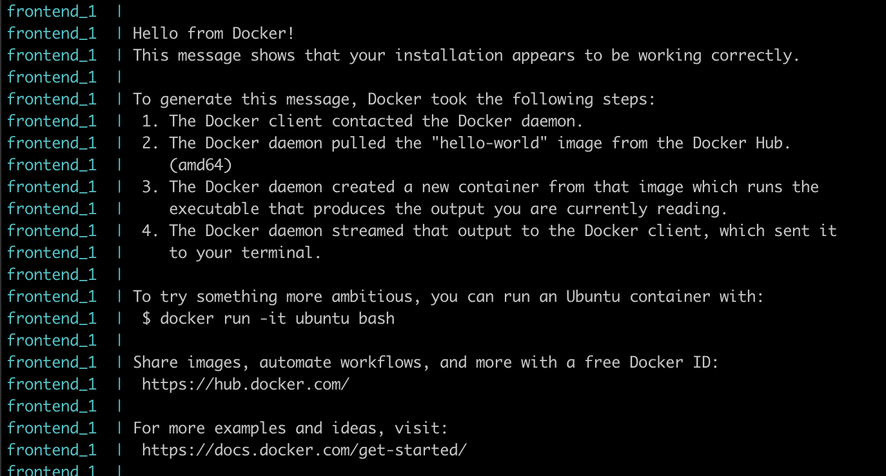
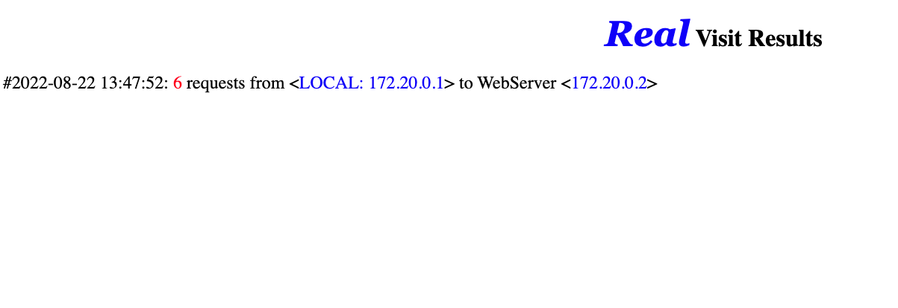

# Simple website docker

Used to test out docker deployment and configuration to my cloud provider.

## Branches
**hello-world** -> to test if your vm has proper setup for docker/git
**master** -> to test if your vm has proper configuration for serving a website

## Usage
```
ssh <name>@<ip>
git clone <your repo>
git checkout hello-world
docker-compose up --build // might need sudo in cases
git checkout master
docker-compose up --build 
A simple website that count's number of page visits from a particular ip should be shown at port 3000
http://<vm-ip>:3000
```

## Screenshot
### hello-world branch

### master branch

